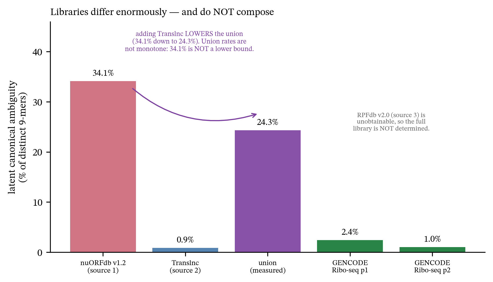

# Extensive canonical-sequence overlap and unresolved source attribution in a public non‑canonical HLA-peptide atlas

*Every number is regenerated from the analysis artifacts by `verify_manuscript.py`, which fails the
build on drift. Every quotation from a primary Methods section has been verified in the fetched full
text.*

> ## What was known / What this study adds
>
> The underlying principles here are established, and we claim none of them.
>
> **Known.** A peptide matching a canonical protein does not identify a non-canonical source and should
> be **excluded** before being called non-canonical (**Bedran et al. 2023**; **Aggarwal et al. 2022** —
> full quotations in the Introduction); the underlying protein-inference problem is textbook
> (**Nesvizhskii & Aebersold 2005**); a pooled FDR under-controls a minority class, so class-specific
> FDR is required (**Woo et al. 2014**; Zhang & Bassani-Sternberg 2023; **pXg**, Choi & Paek 2024).
>
> **Our contribution is empirical:** an audit of whether a major public resource satisfies these
> principles, a measurement of the sequence ambiguity latent in its peptide catalogue and in one of
> its source libraries, a within-resource test of the consequence, and a concrete reporting field
> that would fix it. Aggarwal et al. state that the problem is *not quantified* and that *no specific
> databases are criticised by name*; Bedran et al., who did quantify, did not include IEAtlas.

---

## Abstract

Catalogues of non-canonical (ncORF-derived) HLA-presented peptides are used to nominate cancer-vaccine
targets. A peptide sequence also encoded by a canonical human protein does not uniquely identify a
non-canonical source, since tandem MS identifies a *sequence*, not a locus. The field's own published,
recommended remedy is to **exclude** such sequences before calling a peptide non-canonical (Bedran et
al. 2023; Aggarwal et al. 2022); our contribution is testing whether a major public resource satisfies
it.

We audit **IEAtlas**, not previously examined against this criterion. **98,193 of 174,465 unique
cancer-catalogued peptide sequences (56.3%)** exactly match a protein in a frozen reviewed human
reference *R*, and did so within IEAtlas's own search database — its Methods describe searching spectra
against both its ncORF library and the canonical human proteome — an internal finding, not a comparison
against a reference it never consulted. These matches do not establish canonical production or that any
resource acted improperly; they show the sequence cannot be uniquely attributed to its nominated source
from sequence and MS evidence alone.

Latent canonical ambiguity varies enormously across ncORF libraries — **34.1%** of nuORFdb v1.2's
distinct 9-mers against **1.0–2.4%** for GENCODE Ribo-seq ORFs — but does not determine a catalogue's
rate: the exclusion step does.

The consequence is observable inside the resource: canonical-compatible sequences appear in IEAtlas's
**own** normal-tissue export at **22.4%** versus **9.1%** for canonical-incompatible ones (risk ratio
**2.42×**, gene-clustered bootstrap **95% CI [2.32, 2.52]**); **22,003 sequences (12.6% of the
catalogue)** are both canonical-compatible and already in that export — consistent with, but not
specific to, greater detectability, and warranting normal-presentation review before treatment as a
tumour-restricted target.

Separately and additively, IEAtlas's pooled 5% PSM-level FDR cannot be resolved to a class-specific
estimate for its non-canonical subset without class-resolved target–decoy counts, which it does not
publish. We propose retaining shared sequences with an explicit source-compatibility annotation instead
of treating them as uniquely non-canonical.

---

## Introduction

Non-canonical open reading frames (ncORFs) — in long non-coding RNAs, pseudogenes, untranslated
regions, and alternative frames of coding genes — yield peptides that are presented on HLA molecules
and recognised by T cells. Because their products are absent from the annotated proteome, they have
been proposed as an unusually attractive class of tumour antigen: potentially tumour-restricted,
shared across patients, and not subject to central tolerance. Several public catalogues now aggregate
tens or hundreds of thousands of such epitopes, and these catalogues are the practical input to
target selection.

Building such a catalogue requires answering one question for every identified peptide: **is this
peptide non-canonical?** The question is harder than it appears, and the field has known why for two
decades.

**Tandem MS identifies a sequence, not a source.** A peptide-spectrum match establishes an amino-acid
sequence. It does not establish which genomic locus produced it. Where two loci encode the same
sequence — a canonical protein and an ncORF — no spectral evidence distinguishes them. This is the
protein-inference problem (Nesvizhskii & Aebersold), and in proteogenomics it is *"exacerbated by the
mapping complexity where many identified peptides map to several loci, both novel and known"*
(Aggarwal et al. 2022).

A criterion is published and recommended. Aggarwal et al. (2022) state that *"most shared peptides
should be dropped if defining… novel-coding regions."* Bedran et al. (2023) implement the rule
directly: sequences perfectly matching any known protein are treated as *exonic* and excluded, with a
stringent requirement of *"at least three mismatches with any known protein sequence"* before a
peptide is called non-canonical. A 2026 TransCODE consortium paper implements the same principle for HLA immunopeptidomics
specifically: a peptide is classified as ncORF-derived only if it maps (≥8 aa; ≤30 distinct Swiss-Prot
mappings for canonical, ≤10 distinct ncORF mappings for ncORF-derived) to a ncORF and not a canonical
protein — its own criteria, which the paper itself describes as *"less strict than those used by
PeptideAtlas to avoid mapping canonical protein derived peptides to ncORFs"* (Deutsch et al. 2026):
PeptideAtlas's own production scheme is stricter still, and exists for exactly this purpose. The
underlying rationale presupposes the search process does not do this on its own, exactly as Bedran's
own explicit mismatch threshold does. We call this a **sequence-exclusivity criterion**. It is published
and recommended; we do not assert it is a universal rule binding every atlas. An atlas may
legitimately retain shared observations — provided it labels them as source-ambiguous rather than as
sequence-unique ncORF products. That distinction is the subject of this paper.

A parallel and additive standard governs statistical confidence: a pooled target–decoy threshold
under-controls a minority class, so class-specific FDR estimation is required (Woo et al. 2014, who
measured 36% novel-class FDR at a 1% combined threshold; Zhang & Bassani-Sternberg 2023; Choi & Paek 2024). The same
mechanism recurs outside immunopeptidomics: in bulk proteome-wide noncanonical-protein detection,
Wacholder & Carvunis (2023) show, in *S. cerevisiae* data, that a pooled 1% FDR threshold can correspond
to roughly 56% FDR within the noncanonical subset alone, applying the same canonical-exclusion principle
to a different search context. We cite this yeast estimate for the mechanism it demonstrates — pooled
thresholds under-controlling a minority class — not as a human or immunopeptidomics-specific figure.

What has not been done is to check whether the public resources satisfy these criteria. Aggarwal et
al. review the problem without quantifying it, and note that no specific databases are criticised by
name. Bedran et al. did quantify — reporting residual canonical overlap of 1.4% (Erhard et al. 2018),
3% (Ouspenskaia et al. 2022), 4% (Chong et al. 2020) and 5% (Laumont et al. 2016) — but their
comparison did not include IEAtlas, the largest such atlas and the one most readily used as an
off-the-shelf source of candidate antigens.

This paper is that check.

---

## Results

### R1. Most of IEAtlas's cancer-catalogued sequences also occur in canonical proteins

**The measurement.** A catalogued peptide counts as canonical-compatible if it is an **exact
substring** of at least one protein in a frozen reviewed human reference *R* (release and hash in
Methods). The complementary set — catalogued sequences that are not an exact substring of any
protein in *R* — are termed **canonical-incompatible** in what follows: a reference-relative label, not
a proven absence of a canonical source, since a broader reference could reclassify some of them as
compatible (Discussion). Peptides are deduplicated to **unique sequences**; the unit is a sequence, not
an atlas row.

**98,193 of 174,465 unique cancer-catalogued sequences (56.3%)** are canonical-compatible (**Figure 1**).

Three checks establish that this is not an artifact of how we measured it.

| robustness check | result |
|---|---:|
| headline, reference *R* (current reviewed human proteome) | **56.3%** (98,193 / 174,465) |
| **era-correct**: Swiss-Prot **2022_01**, a plausible candidate for the release IEAtlas searched | **56.2%** (97,999 / 174,465) |
| **by length** (18 strata, 8–25 aa, each *n* ≥ 30) | **46.2%–65.2%** — high throughout, not one band |
| **class composition**: if the atlas contained no pseudogene ORFs at all | **55.8%** |

**Table 1.** Three robustness checks against the headline 56.3% overlap rate: none moves it materially.

The era check settles the anachronism question empirically. Sequence novelty is
reference-relative, so an overlap we score today might reflect a canonical protein that entered the
reference *after* IEAtlas was built — in which case faulting the atlas would be anachronistic. It does
not. Rebuilding the reference at Swiss-Prot 2022_01 (20,376 human proteins) moves the rate by
**0.1 percentage points**; only **231 sequences (0.24% of the overlap set)** are matches that a 2022
analyst could not have made. The overlap was almost entirely visible at build time.

**The 231 and the 0.1 pp both reconcile, and we show the arithmetic rather than leave the reader to
take the net shift on faith.** Going from Swiss-Prot 2022_01 to the modern release is not pure growth:
**231 sequences** gained a canonical match (present only in the modern reference) and **37** *lost*
one (matched a 2022_01 entry later retired, merged, or resequenced) — a **net** change of
231 − 37 = **194** sequences, exactly the difference between the two headline counts
(98,193 − 97,999 = 194). We report the net rate shift (+0.1 pp) as the headline because that is what
answers the anachronism question; the gross 231/37 is reported here because "net" and "gross" are not
interchangeable and a reader checking our arithmetic should not have to guess which one a given number
means.

#### The canonical proteins were in IEAtlas's own search database

The era check above understates the point, because it treats Swiss-Prot 2022_01 as a *reference we
chose*. It is not: whichever exact Swiss-Prot release IEAtlas downloaded, it is **the canonical half of
IEAtlas's own search database.** From its Methods:

> The RAW MS data files were downloaded and analyzed by MaxQuant (v.2.1.0.0) […] Files were searched
> against **both** our integrated benchmarked ncORF library **and the canonical human proteome**
> obtained from the UniProt database with Swiss-Prot protein evidence (downloaded in February 2022).
> […] Only epitopes derived from non-coding regions were retained.

**Which release "downloaded in February 2022" identifies is genuinely ambiguous, and we do not
overclaim it.** UniProt's release immediately before 2022_01 was **2021_04** (current 17 Nov 2021 –
22 Feb 2022); **2022_01** became current only on **23 Feb 2022**. So of February's 28 days, 22 fall
inside 2021_04's window and only 6 inside 2022_01's — if anything, the calendar mildly favors 2021_04,
the release named for November, over 2022_01, the release named for February, which is the reverse of
what naming alone suggests. We built our era-correct comparator at 2022_01 and label it a **plausible
candidate**, not an identified match; we have not built 2021_04 and do not assert its overlap rate.
What we do assert: total Swiss-Prot grew by only 1,068 entries (≈0.19%) across the entire 14-week gap
between these two releases, worldwide and all organisms combined — smaller than the movement between
2022_01 and the *modern* release measured directly above (which spans several years and materially more
growth, and still only shifted the overlap rate by 0.1 pp). Whichever of the two February-2022
candidates IEAtlas actually used, the era-correct check's own finding — that Swiss-Prot vintage barely
moves this rate — makes it implausible that the choice between them would move it by anything
approaching 0.1 pp either. We report the 2022_01 build as the concrete comparator because a comparator
has to be built at some point, not because we can name the exact release with confidence.

MaxQuant is named directly in that Methods passage (quoted in full above, not assumed). Given several
FASTA inputs, it concatenates them into a single target database; every spectrum is scored against
canonical and non-canonical candidates **together**. So for each of the **97,999
(56.2%)** catalogued sequences that occur in a canonical human protein — in our plausible-candidate
reconstruction of the release, not a confirmed identical copy of IEAtlas's own file — an entry carrying
that identical sequence was physically present in the database the spectrum was matched against,
alongside the ncORF to which the peptide was ultimately attributed.

Nothing here depends on that being one search rather than two. Were the two FASTAs instead searched
separately and compared, the canonical proteome would still have been consulted by the pipeline that
produced the catalogue, and the overlap would still have been visible to it. The claim is only that
the canonical sequences were inside the procedure, not outside it — which is what the Methods say.

What we reconstructed, and what we did not obtain. We do not hold IEAtlas's literal search FASTA —
the exact byte-for-byte file its MaxQuant run consumed, with its specific isoform-inclusion settings,
accession list and header format. What we hold is a **release-matched reconstruction**: Swiss-Prot
2022_01 human entries (OX=9606), rebuilt live from UniProt's own archived release, matching what the
Methods describe downloading. A rebuilt release and the literal searched file are not guaranteed
identical — UniProt's isoform-inclusion defaults, an unrecorded canonical-only-vs-all-isoforms toggle,
or a differently scoped taxonomy query could each produce a slightly different entry set from the same
nominal release. We do not have IEAtlas's `peptides.txt` or database hash to check this directly. The
era-correct check above is therefore the load-bearing evidence for this claim, not the modern
reference: it shows the reconstructed 2022_01 database and the modern one agree to 0.1 pp, so the
finding is not sensitive to exactly which entries a given Swiss-Prot build snapshot happens to carry.
We consider this sufficient to say the canonical proteins were present in *a* database matching what
IEAtlas describes searching, and we phrase the claim that way rather than asserting identity with a
file we have never seen. Obtaining IEAtlas's own `peptides.txt` would settle this outright (§ Discussion,
"Evidence required for direct verification").

This changes what kind of claim the paper is making. The source ambiguity is not something an external
auditor reconstructed after the fact against a reference the resource never consulted. It is a
property of the search itself, and the search engine's output can carry it: MaxQuant's `peptides.txt`
includes a `Proteins` column listing every database entry that contains each peptide, so the
compatible-source mapping the remedy in §5 asks for was **available to the search software**. We do
not have IEAtlas's own `peptides.txt` or the code that transformed it into the public export, so we do
not know when or how that mapping was lost; what the Methods establish is only that it was not
propagated to the public atlas export, which records the ncORF attribution alone.

The exclusion test is also not a foreign operation. Building the library, IEAtlas reports that *"FASTA
files of peptides were merged, and **peptides entirely contained within other peptides were
removed**."* That is an exact substring-containment test — the same test this paper applies — run
across the ncORF library to remove internal redundancy. It is not described as having been run
**against the canonical proteome**, though that proteome was loaded into the same search. The remedy
is that operation applied once more, in a direction the pipeline had already implemented.

The reading is falsifiable and we state the check: had the canonical half of that database been used
to **exclude** shared sequences — as CrypticProteinDB and Raja et al. describe doing, and as their
rates of 0.026% and 0.17% reflect — this rate would be near zero. It is 56.2% against our
plausible-candidate reconstruction of the database (56.3% against the modern reference) — either way,
not near zero, regardless of which exact release built the database.

**This does not show that any peptide is canonically derived, and it does not show that anyone acted
improperly.** Sequence identity is symmetric, and the canonical entry is not "the right answer" either;
MS identifies the sequence, never the locus. What it shows is that the evidence needed to mark these
sequences *source-ambiguous* was inside the pipeline that produced the catalogue.

**Under one pipeline**, applied identically to every catalogue we could reprocess — same reference,
same exact-substring criterion, same unique-sequence unit:

| catalogue | exclusion rule in its Methods? | canonical-sequence overlap |
|---|---|---:|
| CrypticProteinDB | **yes** — *"BLASTP… eliminate all proteins with alignment to canonical proteins"* | **1 / 3,810 = 0.026%** |
| Raja et al. (ovarian) | **yes** — *"peptides mapping to 'protein_coding'… were excluded"* | **5 / 2,979 = 0.17%** |
| **IEAtlas** | **not described** — *"only epitopes derived from non-coding regions were retained"* | **98,193 / 174,465 = 56.3%** |

**Table 2.** Canonical-sequence overlap under one pipeline, one reference and one peptide unit, for two
catalogues with an explicit exclusion rule versus IEAtlas, which has none described.

For context, Bedran et al. 2023 report residual canonical overlap of 1.4% (Erhard), 3% (Ouspenskaia),
4% (Chong) and 5% (Laumont). We do not compute a fold-change against those values. They were
produced with a different reference, normalization, deduplication and peptide unit, and a ratio across
pipelines is arithmetic rather than measurement. They are cited as published context. The controlled
comparison is the table above.

#### It is not the ORF-class composition

IEAtlas's ncORF library explicitly includes pseudogenes, the class with the highest canonical
compatibility. A peptide may carry more than one ORF label — 1,801 sequences (1.0%) map to more
than one gene, and 546 carry both a pseudogene and a non-pseudogene ORF — so pseudogene and
non-pseudogene sets are *not* complements. We instead report three mutually exclusive strata, which do
partition the catalogue exactly:

| stratum (mutually exclusive) | *n* | canonical-compatible |
|---|---:|---:|
| pseudogene-only | 15,777 | **59.4%** |
| non-pseudogene-only | 158,142 | **55.8%** |
| both labels (source-ambiguous within the atlas) | 546 | **93.0%** |
| **total** | **174,465** | **56.3%** |

**Table 3.** The catalogue partitioned into three mutually exclusive ORF-class strata; canonical-compatibility
is high in all three.

If the atlas contained no pseudogene ORFs whatever, the rate would be **55.8%**. Class composition
moves the headline by half a percentage point. Separately, Raja et al. report 98 pseudogene-ORF
peptides and **none** overlaps a canonical protein, because their exclusion rule removed those that
did — same ORF class, different rule.

That 1.0% of sequences map to several genes *within the atlas's own annotations* is itself a small,
direct instance of the ambiguity this paper is about.

### R2. The consequence is observable inside the resource

An audit that stops at *"56.3% of these sequences are source-ambiguous"* invites the only question
that matters: **so what?**

If a canonical-compatible sequence is in fact produced from the canonical locus it is compatible
with, it would be expected to also be presented on **normal tissue**, because that protein is
expressed there too. This is testable without resolving provenance: IEAtlas publishes its own
normal-tissue epitope export (94,375 unique peptides), so the prediction can be checked **inside
the resource**, comparing canonical-compatible sequences against the canonical-incompatible sequences of
the same catalogue as a **within-resource comparator** (**Figure 2**).

| IEAtlas cancer-catalogued sequences | also in IEAtlas's **own** normal-tissue export |
|---|---:|
| **canonical-compatible** (98,193) | **22,003 = 22.4%** |
| canonical-incompatible — within-resource comparator (76,272) | 6,976 = **9.1%** |

**Table 4.** Canonical-compatible sequences are reported in IEAtlas's own normal-tissue export at more than
twice the rate of canonical-incompatible ones.

![Figure 2. (a) The length-standardized risk ratio for co-occurrence in IEAtlas's own normal-tissue export, canonical-compatible versus canonical-incompatible cancer-catalogued sequences, with its gene-clustered bootstrap interval. (b) The 22,003 canonical-compatible sequences already in the normal-tissue export, as a share of the whole cancer catalogue -- their co-occurrence in both of IEAtlas's own exports needs no external reference, though canonical-compatibility itself (R1) is assigned using Swiss-Prot.](figures_v2/f2_consequence.png)

Estimating the association, and naming what it can and cannot account for. These 174,465
sequences are *not* independent Bernoulli
observations — they are plausibly clustered by source gene, gene family, dataset, tissue, donor, HLA
allele and pipeline — and peptide length confounds both arms. Two of these axes are resolvable from
IEAtlas's own published exports (source gene; tissue) and are modeled directly, below. Gene family,
dataset, donor, HLA allele and pipeline are not joinable to individual peptide records in the files
IEAtlas makes available (its sample-level metadata carries no key back to the peptide export) and are
acknowledged, not modeled. Accordingly:

- **Per length, unpooled**, the risk ratio ranges **1.55–3.08** and the effect holds at **all 18**
  peptide lengths (8–25 aa).
- **Length-standardized** (direct standardization to the catalogue's own length distribution) the risk
  ratio is **2.42×** — essentially the crude 2.45×, so length is not driving it.
- **Gene-clustered bootstrap** (resampling 22,765 source-gene clusters with replacement, *B* = 2,000):
  **95% CI [2.32, 2.52]**.
- **Tissue-clustered bootstrap** (a second, independent clustering axis: resampling 15 cancer-type
  clusters with replacement, same *B*): **95% CI [1.86, 3.29]** — excludes 1.0 under this axis too, but
  read this interval as indicative, not precise: the 15 clusters are heavily unbalanced (the two largest
  hold 41% of the catalogue between them), giving an **effective cluster count of 7.9** (the Herfindahl
  measure 1/Σp²) — below what cluster-bootstrap practice generally treats as reliable for percentile-CI
  coverage. It is reported as a second, cruder check, not as equal-weight evidence alongside the
  gene-clustered CI above.
- Within every ORF-class stratum, length-standardized: 2.39× (pseudogene-only), 2.40×
  (non-pseudogene-only), 1.75× (both, n = 546 — the smaller, source-ambiguous-within-the-atlas
  subgroup).

A further, unresolved possibility is that canonical-compatible sequences' own greater breadth of
detection (R3, Prediction 1: detected across more cancer types on average) is itself part of why they
recur more often in the normal-tissue export, independent of any true normal-tissue expression — a
detection-opportunity effect, not restricted to abundance. We have not isolated this from the
association reported here.

A two-proportion *z*-test is not valid for this contrast — it would treat a heavily structured
catalogue as 174,465 independent experiments, and being directionally right would not rescue it. The
clustered interval above is the correct measure of precision here.

A subset requires no inference at all — to see the co-occurrence, though not to name it
"canonical-compatible." **22,003 unique sequences — 12.6% of the cancer catalogue — are both
canonical-compatible and already present in the atlas's own normal-tissue export.** That these 22,003
sequences occur in *both* of IEAtlas's own exports is internal to the resource and needs no external
reference; that they are *canonical-compatible* in the first place is R1's finding, and R1 uses Swiss-Prot.
The two parts of the claim rest on different evidence — only the co-occurrence is reference-free.

A further caveat on what "present in the normal-tissue export" establishes: IEAtlas's Methods report
that MaxQuant's *"'match between runs' option was set with default settings"* for this analysis, so an
entry in the normal-tissue export is not guaranteed to be an independent MS/MS identification in that
tissue — some fraction may be transferred (matched-between-runs) identifications from a run where the
peptide *was* directly sequenced. IEAtlas's public exports do not carry a field distinguishing the two.
Accordingly we say a sequence is **reported in**, or **co-listed in**, the normal-tissue export — not
that it was independently *observed* or *presented* there — and the practical conclusion (normal-presentation
review before treating it as tumour-restricted) is unchanged either way: a transferred identification
still means the resource itself asserts the peptide's presence in that normal sample.

**What this means, bounded.** This is **consistent with, but not specific to**, greater detectability
or expression of canonical-compatible sequences. It does not show that any individual sequence is
canonically derived: inclusion in a normal-tissue export is evidence about **reported detectability**,
not about **source** — and, per the MBR caveat above, not necessarily about direct observation in that
tissue either. Its practical consequence is that such a sequence warrants normal-presentation review
before it is treated as a tumour-restricted target — clinical risk depends additionally on allele
matching, tissue context, abundance and TCR avidity, none of which we assess. Concretely: IEAtlas's own
sample metadata records a Class I/Class II split among its contributing mass-spectrometry runs (1,942
Class I, 1,159 Class II), but that field is not joinable to individual catalogued peptides in the
**bulk exports used in this study** — so neither the 56.3% overlap nor the 22,003 figure can be
stratified by HLA class or allele from the files we analyzed, and we do not attempt it. (IEAtlas's live
gene-search interface does expose HLA class and allele as per-epitope, per-query fields; that is a
different access path from the bulk exports this paper's pipeline consumes, and re-deriving 174,465
class/allele labels one query at a time is out of scope here.)

### R3. Latent canonical ambiguity differs enormously between libraries — and does not compose

Applying the same measurement to the **search space** rather than the output — the distinct 9-mers of
each ncORF library, and how many also occur in reviewed canonical human proteins (**full libraries, no
sampling**; **Figure 3**):

| ncORF library | ORFs | distinct 9-mers | canonical-compatible |
|---|---:|---:|---:|
| **nuORFdb v1.2** — integrated by IEAtlas | 229,251 | 8,448,245 | **34.1%** |
| GENCODE Ribo-seq ORFs (phase 1) | 7,264 | 245,094 | **2.4%** |
| GENCODE Ribo-seq ORFs (phase 2) | 28,359 | 502,528 | **1.0%** |

**Table 5.** Latent canonical ambiguity (9-mer canonical-compatibility) of each ncORF library, measured
under one pipeline.

Both libraries were measured by us, under one pipeline, so the contrast *is* a controlled one:
**ncORF libraries differ by 14–34× in latent canonical ambiguity.** Whole-ORF containment is low
throughout (0.2–0.8%), so this is **extensive partial sharing**, not whole ncORFs nested inside
canonical proteins.

**Independent corroboration.** These figures were obtained twice, by separate implementations over
different k-mer windows: an 8–11mer candidate-universe enumeration gives nuORFdb **34.4%** and GENCODE
Ribo-seq (phase 1) **2.5%**; the 9-mer enumeration above gives **34.1%** and **2.4%**.

#### The integrated library does not inherit nuORFdb's ambiguity

34.1% is **not a lower bound** on IEAtlas's complete integrated library (nuORFdb + RPFdb + Translnc).
Adding a library *B* to nuORFdb *A* changes the rate to |(*A* ∪ *B*) ∩ *C*| / |*A* ∪ *B*|, which is
**not monotone**: if *B* contributes mostly non-canonical *k*-mers, the combined proportion **falls**.

It falls. We obtained Translnc — a second of IEAtlas's three sources, in the version it cites — and
measured the union directly. **Translnc's distributed FASTA is multi-species**: 435,173 human
(ALL-CAPS gene-symbol convention) headers followed by 148,667 mouse-convention headers (`Tug1-...`,
`Gm10619-...`, RIKEN clone IDs). A mouse 9-mer cannot legitimately enlarge the denominator of a rate
scored against a *human* canonical reference — it dilutes the calculation with sequences a human
immunopeptidome search space never contained. We report the **human-only** union as primary and the
whole-file union alongside it as a diagnostic of how much species-filtering matters:

| library | distinct 9-mers | canonical-compatible | rate |
|---|---:|---:|---:|
| nuORFdb v1.2 | 8,448,245 | 2,884,119 | **34.1%** |
| Translnc, human-only entries | 3,728,231 | 32,096 | **0.9%** |
| **nuORFdb ∪ Translnc (human-only)** | 11,934,337 | 2,902,793 | **24.3%** |
| *(diagnostic) Translnc, whole file (human + mouse)* | *6,164,584* | *39,382* | *0.6%* |
| *(diagnostic) nuORFdb ∪ Translnc, whole file* | *14,364,357* | *2,907,391* | *20.2%* |

**Table 6.** The nuORFdb/Translnc union: adding a second library lowers, not raises, the combined
ambiguity rate.

Translnc is almost free of latent canonical ambiguity under either filtering, and the two libraries are
nearly disjoint (2.0% of the human-only union's 9-mers occur in both). Adding it therefore enlarges the
denominator far faster than the numerator, and the rate **drops by 9.8 pp, from 34.1% to 24.3%**
(human-only) — **13.9 pp, to 20.2%**, if mouse sequences are left in undiluted. This is the
non-monotonicity above made concrete: adding Translnc **lowers** the rate, on one of IEAtlas's own
other sources, under either convention. (Re-scored against
Swiss-Prot 2022_01, human-only union: 24.3%, essentially unchanged.)

The gap between the two is plausibly not arbitrary. Translnc catalogues ORFs annotated on **lncRNA
transcripts**; nuORFdb catalogues ORFs of **coding genes** — uORFs, dORFs, out-of-frame and in-frame
alternative ORFs — whose reading frames overlap or abut the very proteins in the canonical reference.
lncRNA annotation is not a guarantee of zero coding-gene overlap — lncRNA loci can be intergenic,
antisense, intronic or sense-overlapping with a coding gene, and we have not stratified Translnc by
that relationship — but the measured **~40×** gap between the two libraries (34.1% vs 0.9%, human-only)
is consistent with a library's
latent ambiguity being **contributed to** by whether its ORFs sit inside coding genes, a property its
builders already know and could report at zero cost, without our claiming that relationship as a
general mechanism verified by direct genomic-context stratification. This is the concrete
content of recommendation (c) in §5.

What is and is not now bounded. RPFdb v2.0 remains genuinely unavailable — the live site serves
only v3.0, and it distributes RibORF genomic *coordinates*, not amino-acid sequences, so
back-translation would produce *our* library rather than IEAtlas's. Carrying its contribution as the
single unknown *m* (novel 9-mers it adds, of which *x* are canonical), the combined rate is
(*h* + *x*) / (*u* + *m*). Maximising over both, the three-source library's 9-mer ambiguity **cannot
exceed 53.5%** under the human-only union (**47.6%** under the whole-file union), distribution-free and
whatever RPFdb contains. That cap is a **hard ceiling, not an estimate**: it is attained only in the
corner where every canonical 9-mer not already in the union is contributed by RPFdb *and* RPFdb
contributes nothing else. There is **no positive lower bound derivable from the sources we hold**: as
*m* grows, *h*/(*u* + *m*) → 0. The combined rate is not determined by our measurement, and no
measurement of a subset of the libraries could determine it.

The library is not sufficient on its own. The evidence that the *exclusion step*, not the library,
is what governs a catalogue's overlap rate is our own same-pipeline reprocessing: CrypticProteinDB and
Raja et al., which describe explicit exclusion rules, sit at **0.026%** and **0.17%** (§1). Ouspenskaia
et al. add the one control neither of those provides — they searched the **same nuORFdb** and their
published catalogue is nonetheless low (3%, Bedran et al.). We attach **no arithmetic** to that 3%: it
is a published cross-pipeline figure, and the unit caveat above applies to it as much as to any other.
The qualitative point is all we need and all we claim — a high-ambiguity library does not force a
high-ambiguity catalogue.

#### A detection effect, tested — scope of inference

**We do not compare the catalogue's rate to the library's as levels.** The catalogued 56.3% and
nuORFdb's 34.1% are different objects: 56.3% is over distinct catalogued *peptides* at native lengths,
after search, FDR and deduplication; 34.1% is over distinct *9-mers* of a candidate search space in
which nothing has been detected. Different units, different denominators, different lengths — the same
cross-unit error as the fold-change comparison against other catalogues that §1 declines to make, and
it is not rescued by the union figure either (56.3% must not be read against 24.3%/20.2%, or against
the 53.5%/47.6% caps).

The detection hypothesis is nonetheless real and testable *without* that comparison — a peptide of an
abundant, ubiquitous protein should be over-detected in an immunopeptidome relative to its share of the
search space. Both tests below are internal to a single space or are ratios of ratios, so neither
requires a cross-unit subtraction.

**Prediction 1 — breadth of detection.** A peptide of an abundant, ubiquitous protein should be
detected across more of IEAtlas's 15 cancer types. Canonical-compatible sequences are seen in a mean
of **1.62** cancer types versus **1.33** for canonical-incompatible ones, and **28.3%** appear in ≥2 types
versus **16.8%**. Because short peptides both match canonical proteins more readily and recur more
often, we stratified by length: the effect holds in **18 of 18** length strata (8–25 aa). It is not a
length artifact.

**Prediction 2 — enrichment for the abundant housekeeping class.** Ribosomal proteins are the textbook
abundant, ubiquitous class. In the catalogue, canonical-compatible sequences are **2.51×** enriched
for ribosomal-gene ORFs (2.89% vs 1.15%). This could be pure library composition, so we measured the
same enrichment **in the library**, over **distinct 9-mers** — the same unit as the library's headline
ambiguity rate (§R3), not raw (ORF, 9-mer) occurrence pairs, which would double-count a 9-mer once per
ORF that contains it and so are not the same unit as the catalogue side. There, ribosomal-associated
9-mers are **depleted** among canonical-compatible candidates in the nuORFdb-only library (**0.69×**),
giving a nuORFdb-only-baseline excess of **3.66×** — but nuORFdb alone is not the full three-source
library IEAtlas integrates, and this specific figure is not robust to that choice (below). Folding in
Translnc — a second source we hold, whose union with nuORFdb we already computed for the headline
ambiguity rate (34.1% → 24.3%, human-only) — moves the library-side ribosomal rate up and the excess
down to **2.34×** under the human-only convention we report as **primary throughout this paper**, or
**1.85×** using the whole Translnc file with mouse sequences left in (the diagnostic convention, kept
only to show what species-filtering changes; **Figure 4** plots the human-only, primary pair). RPFdb
v2.0's contribution is, as in §R3's headline ambiguity rate, unmeasured. The qualitative conclusion — the
catalogue's enrichment exceeds its own search space's, under every variant we can compute — is what P2
supports; **the specific 3.66× should not be quoted as the headline number, and neither figure should be
read as showing the excess "arose during detection" in some further causal sense beyond that
comparison.**

Note what Prediction 2 does and does not compare. It is a **ratio of ratios** — an *enrichment* measured
within the catalogue, set against the *same enrichment* measured within the library, both over distinct
sequence units — and a ratio of ratios is dimensionless, so it survives the unit mismatch that would
make a direct comparison of the catalogue's and the library's raw ribosomal-association rates
meaningless. But dimensionless is necessary, not sufficient: the two ratios must also be computed over
the **same observational unit**, or the excess can reflect how each side weights individual sequences
rather than any real effect — a 9-mer repeated across many near-identical ORFs (ribosomal paralogs are
exactly this) would otherwise be counted once per occurrence rather than once per sequence, inflating
its apparent weight. The catalogue side is already over distinct catalogued peptide sequences (as
throughout this paper); the library side must therefore use **distinct 9-mers**, not raw (ORF, 9-mer)
occurrence pairs, to match — the same unit as §R3's headline library rates. It says the association
between being canonical-compatible and being ribosomal is stronger in the catalogue than in the search
space it was drawn from. It does **not** license any claim that the catalogue's overlap rate sits some
number of percentage points above the library's — that quantity is not defined.

A further check on what "ribosomal" is doing here. `RPL*`/`RPS*`/`MRPL*`/`MRPS*` gene symbols include
not only protein-coding ribosomal genes but their retro-transposed pseudogenes (e.g. *RPS3AP12*, §S1) —
canonical-compatible for an unrelated, already-established reason (pseudogene biology, not abundance or
detection). Splitting the class with the same authoritative NCBI pseudogene→parent registry used for
S1 shows the excess is not pseudogene contamination wearing a ribosomal label: isolating true
protein-coding ribosomal genes alone gives an excess of **3.47×** (nuORFdb-only baseline) — at least as
large as the **3.66×** pooled figure above — and the ribosomal-named-pseudogene subset separately shows a
smaller but still positive excess (**2.16×**), consistent with those sequences riding on their parent's
abundance rather than a distinct mechanism.

**Prediction 3 — the direct test.** Predictions 1 and 2 use *breadth of detection* and *ribosomal
membership* as **proxies** for abundance. We replace them with a measurement: **PaxDb v6.1** (human,
whole-organism integrated, ppm), joined to the canonical proteins the catalogued sequences actually
match (**91.4%** of the reviewed proteome joins; 96,210 of the 98,193 overlapping sequences carry an
abundance).

*Which canonical proteins do the catalogued sequences hit?* **Abundant ones.** At the protein level —
where there is no peptide-clustering problem at all, because the unit *is* the protein — canonical
proteins hit by a catalogued sequence have a median abundance of **0.872 ppm** against **0.086 ppm**
for those never hit, a **10.14×** difference (AUC **0.679**).

The "never hit" population is not restricted to proteins the search could plausibly have reached.
Splitting it by whether the protein's gene appears anywhere else in the 174,465-sequence catalogue —
a candidate existed for the gene, it just didn't overlap this specific protein — against genes absent
from the catalogue entirely: restricting the comparison to the **reachable** subset (n = 3,480, median
0.236 ppm) drops the fold to **3.69×** (AUC **0.601**); the fully unreachable subset (n = 3,562, median
0.042 ppm) alone gives an even larger 20.76× (AUC 0.755). The direction is unchanged under every
split — hit proteins are more abundant than any comparator — but the unrestricted 10.14× overstates it
by roughly this much; **3.69×** is the more defensible figure. This selection effect does not touch the
detection-breadth test below, which never uses the "never hit" population.

*Reachability by catalogue co-occurrence is one operationalization; reachability by library content is
another, and gives a different, weaker restriction.* A protein's gene appearing elsewhere in the
catalogue is an *output*-side signal. A more search-side definition asks whether the reconstructed
ncORF library itself (nuORFdb ∪ Translnc, human-only, **11,934,337** distinct 9-mers) shares even a
single 9-mer with the protein at all — i.e., whether the search space contained *any* sequence that
could in principle have been proposed as an overlapping candidate, independent of what the catalogue
happened to surface. Under this definition, **3,912** of the 7,042 never-hit proteins qualify as
library-reachable (median **0.100** ppm) against **3,130** that share no 9-mer with the library at all
(median 0.070 ppm) — dropping the fold to **8.72×** (AUC **0.667**), a smaller correction than the
catalogue-co-occurrence restriction. This is expected, not a discrepancy: with **12.1 million** distinct
9-mers in the reconstructed library, most proteins of ordinary length share *some* 9-mer with it by
chance, so "shares ≥1 library 9-mer" is a comparatively weak filter — only 44.4% of never-hit proteins
are excluded by it, against 50.6% excluded by the catalogue-co-occurrence restriction. That the stricter,
output-based restriction (3.69×) sits *below* the library-content one (8.72×), rather than above it,
means the originally reported figure was already the more conservative of the two available corrections,
not an outlier chosen for effect. We report both rather than picking one.

*Does abundance predict how broadly a peptide was detected?* Yes — but weakly, and we state the
weakness rather than the headline. Binning canonical-compatible sequences by the abundance of their
matched canonical protein, mean detection breadth rises across every quintile after length
standardization, from **1.40** cancer types (Q1) to **1.78** (Q5) — a Q5−Q1 gap of **0.377**, with a
gene-clustered bootstrap **95% CI [0.335, 0.42]** that excludes zero under **both** cluster definitions
(matched canonical gene, and IEAtlas source gene), and which reproduces on the previous PaxDb release
(**0.38**). The crude, unstandardized trend saturates — it climbs through the low quintiles and
flattens across the top — and is monotone *only* after length standardization; the crude gap is
**0.23**. The direction and the interval are solid. **A strong dose–response is not**, and we do not
claim one.

Three controls, each of which could have killed it:

| control | the attack it answers | result |
|---|---|---|
| **peptide length** | short peptides both match canonical proteins more readily *and* recur more | trend holds in **18 / 18** length strata |
| **protein length** | longer proteins are hit more often *by chance*, so "hit" may just mean "long" | hit proteins **are** longer (median 490 vs 360 aa) — but the abundance effect holds in **10 / 10** protein-length deciles |
| **placebo** | does the machinery invent trends? | breaking the peptide→protein link **collapses** the gap to **0.0** (0 of 200 draws reach the observed 0.377) |

**Table 7.** Three controls for the abundance-predicts-detection trend, each capable of falsifying it.

What this licenses, and what it does not. The abundance explanation is now **measured, not
proxied**: canonical-compatible sequences preferentially match abundant canonical proteins, and that
abundance predicts detection breadth, surviving peptide length, protein length and a placebo. But the
per-sequence association is **weak** (Spearman ρ = **0.061**): abundance is *one* contributor to which
sequences get detected, **not** the whole explanation, and we do not claim otherwise. Nor does any of
this speak to provenance — it is evidence about **what gets detected**, and MS still identifies the
sequence, never the locus.

### R4. The additive statistical problem, and the remedy the field already demonstrated

The phenomenon is not novel (Woo et al. 2014 measured it empirically; Choi & Paek 2024). The
closed-form bound below is this paper's own elementary derivation, checked directly against Woo et
al. 2014, which does not contain it. Stated here because it is *additive* to R1–R3, and
because IEAtlas reports nothing that would allow it to be assessed.

From a reported pooled FDR *q* and class fraction *f*, the class-specific FDR is only
**set-identified**. (The Supplement derives this exactly for the *realized* false-discovery
*proportion* — writing it as *FDP*, not *FDR*, to keep the arithmetic from reading as a claim about an
expectation — and evaluates it at the reported *q* as a stand-in for the true, unobserved proportion.
We use *q* and *FDR* here as the field's working shorthand for that same estimated quantity.)

    Θ_N(q, f) = [ max(0, (q − (1 − f)) / f),  min(1, q / f) ]

From *q* and *f* alone, this identified set is sharp. IEAtlas reports *q* = 0.05 and 245,870
non-canonical epitopes, but **no canonical count**. *f* is therefore unknown and the interval is
**unconstrained**.

**The 245,870 figure is also not the right unit for *f*, independent of the missing canonical count —
and it is not even the quantity we first took it for.** IEAtlas's Methods report *q* = 0.05 as a
**peptide-spectrum-match (PSM)** false-discovery rate — *"A peptide spectrum match false discovery rate
(FDR) of 0.05 was used, and no protein FDR was set"* — a quantity estimated over accepted PSMs. 245,870
is a deduplicated epitope-level total, but it is **not** a cancer-plus-normal-tissue union at the
peptide level. IEAtlas's Methods separately report that *"54 017 epitopes for HLA-I and 51 015
epitopes for HLA-II passing HLA immunogenic tests... account for 37.16% and 50.76% of HLA-I- and
HLA-II-binding epitopes, respectively"* — an unambiguous pairing (the denominator is named explicitly)
from which the HLA-I and HLA-II totals are 54,017 / 0.3716 ≈ **145,363** and 51,015 / 0.5076 ≈
**100,502**. These sum to **245,865**, matching the published 245,870 to within the rounding of two
published percentages. IEAtlas's own public browse interface independently states the exact totals
directly, without the rounding: **145,366 HLA-I-bound and 100,504 HLA-II-bound non-canonical
epitopes**, which sum to **exactly 245,870** — confirming the Methods-derived estimate above by a
second, independent route. (IEAtlas's Methods elsewhere also state that *"60.60% and 41.90%
non-canonical epitopes were bound by HLA-I and HLA-II allotypes, respectively"*; we do not use this
sentence in the arithmetic above, because its denominator is not stated explicitly and multiplying it
by 245,870 gives totals — 148,997 and 103,020 — that do not agree with the two totals above closely
enough to be the same quantity. It is left unreconciled and not load-bearing for what follows.)
**245,870 is, at minimum, extremely close to IEAtlas's HLA-I-bound-epitope count plus its
HLA-II-bound-epitope count — a class-summed total, not a tissue-summed one.** It might appear that
174,465 + 94,375 − 245,870 = 22,970 gives the number of sequences shared between the cancer and normal
exports; that arithmetic is correct but the inference is wrong. The two exports' true peptide-level
overlap is not an algebraic residual of a class-summed total — it is directly measured, elsewhere in
this paper (R2):
**22,003 + 6,976 = 28,979** cancer-catalogued sequences also occur in the normal-tissue export, roughly
6,000 more than the residual implied. Because 245,870 conflates HLA class with nothing about tissue, it
cannot be used to check, or substitute for, the cancer/normal totals at all; this is a second,
independent unit mismatch, not a restatement of the PSM-versus-peptide one above. Neither the number of
accepted PSMs nor the non-canonical share of accepted PSMs — the quantities that would instantiate *f*
at the same unit as *q* — is published anywhere we have found. Closing Θ_N(*q*, *f*) would require
PSM-level, class-resolved accept/decoy counts, not merely a peptide-level canonical count, at whatever
tissue or class aggregation.

Reporting the per-class accepted target and decoy counts (*T_N*, *D_N*), the threshold, the unit and
the convention would make the selected class-specific target–decoy estimate **reconstructible**. This
is not the only information that could tighten the interval — calibrated class-specific posterior error
probabilities or entrapment measurements could also do so — and *D_N* does not identify the true
class-specific false-discovery proportion. It is simply the cheapest sufficient object, and one the
pipeline already computes.

The field has demonstrated the remedy, and its cost. Ouspenskaia et al. searched a combined
annotated-ORF/nuORF database and reported that a 1% global FDR gave *"4.6% overall, and as high as 14%
for 3′ dORFs"* among nuORF peptides; group-based filtering *"removed 24% of nuORF peptides overall, and
up to 76% of peptides assigned to 3′ overlap dORFs."* **The 4.6% is a pre-correction diagnostic, not
the error rate of their published catalogue.** They are a positive exemplar.

### R5. Two distinct problems; one reporting remedy; and what it costs

The two defects are **complementary, not the same**, and merging them is a category error:

- **Source ambiguity (R1–R3).** The peptide is *correctly identified as a sequence*; its **source
  locus** is unresolved. This is not an FDR problem — no identification is wrong.
- **Class-specific FDR under-control (R4).** A pooled threshold *can* under-control the minority class,
  meaning some ncORF identifications *may be* wrong — the spectrum was not that peptide. For IEAtlas
  specifically, R4 shows this cannot be checked either way: with *f* unknown, Θ_N(0.05, *f*) reaches
  down to 0, so the published numbers are equally consistent with zero wrong ncORF identifications as
  with many. The mechanism is established; whether it bites for this resource is not.

It might seem that FDR could not *explain* the 56.3%, on the grounds that a composition-matched
shuffle places chance canonical overlap near 0.1% — but that argument does not hold. A false target PSM
is not an arbitrary shuffled string; it is an accepted, incorrect candidate drawn from the actual
search database, and its class composition is not described by a shuffle null. The correct statement
needs no such argument: source ambiguity is present *even when the
sequence is correctly identified*. FDR concerns whether the spectrum was assigned to the right
sequence; canonical overlap concerns whether that correctly-identified sequence determines a source.
They are different objects.

A minimal standard addresses both.

**(a) Per peptide — an exclusivity flag and all compatible source loci.** State whether the sequence is
unique to the nominated ncORF within the searched space, and if not, list every compatible source. This
preserves the peptide *and* the ambiguity, rather than discarding either, and it is strictly more
informative than the exclusion rule it generalises.

*This requires one additional reporting field.* A remedy that demanded a long list of loci per peptide would be glib, so we measured
the list. Across the 97,999 catalogued sequences that match the canonical half of IEAtlas's own search
database, the **median number of compatible canonical genes is 1**; **93.1% are compatible with exactly
one** canonical gene and **98.0% with at most two** (maximum 22). The label is, for the large majority
of ambiguous sequences, **a single gene symbol** — one column, not a redesign. And as §1 showed, a
concatenated search already computes it: MaxQuant's `peptides.txt` lists every database entry
containing each peptide. The remedy asks resources to **publish a column their own pipelines already
produce**.

**(b) Per class — a class-decoy ledger.** Accepted target and decoy counts per class, the class
definitions, the thresholding stage, and the formula used — enough to reconstruct the class-specific
estimate. Ouspenskaia et al. demonstrate it is achievable.

**(c) Per library — publish the latent canonical ambiguity.** One number (R3), cheap to compute, and it
tells every downstream user how much an exclusion rule matters for the library they are about to
search. No ncORF library currently publishes it.

**The cost, stated plainly.** Under a definition that requires canonical-incompatibility, **98,193 of 174,465 unique
cancer-catalogued sequences (56.3%)** would be ineligible for designation as uniquely non-canonical.
That does **not** require deleting them from the atlas — the remedy in (a) is to retain them and label
them source-ambiguous with their compatible loci. For scale, class-specific FDR control cost
Ouspenskaia et al. 24% of their nuORF peptides and up to 76% of one ORF class. Applying an
established criterion to an ncORF catalogue is expected to be expensive. That is not an argument
against applying it — it is an argument for applying it before, rather than after, a candidate enters
a clinical pipeline.

---

## Discussion

Every resource examined describes its own procedures accurately and in public; that is the only
reason this audit was possible at all. Two of the catalogues measured here already apply an exclusion
rule. Ouspenskaia et al. already solved the statistical half and published the cost of doing so. The
field knows how to do this. What had not happened, as far as we have been able to determine, is a
check of whether the resources already in use apply it. The observed overlap is compatible with
several mechanisms — database composition, annotation transfer, search-space design — and sequence
identity is symmetric: MS identifies the sequence, never the locus, so this analysis does not show any
specific ncORF antigen to be non-real. Distinguishing among these mechanisms for any individual entry
requires the original search outputs and peptide-level provenance.

Where the ambiguity comes from, and where the remedy belongs. A third of nuORFdb's peptide space is
canonical by sequence. We cannot say what the corresponding figure is for IEAtlas's full integrated
library, and we do not claim the library *quantitatively explains* 56.3%. But a library that publishes
its own latent ambiguity lets every downstream group know in advance how much an exclusion rule will
cost them, and the detection effect measured in R3 shows that what a catalogue reports is not simply a
readout of what its library contains. We have not found this number published for any ncORF library,
and computing it is inexpensive — a distinct-9-mer overlap scan against a reference proteome, as done
here.

The stakes are not abstract. A sequence catalogued as a cancer epitope, which is canonical-compatible
and which the same atlas's own normal-tissue export already lists, is not a promising tumour-restricted
target without further review. **22,003 unique sequences in IEAtlas meet both conditions.** (R3 shows
canonical-compatible sequences skew toward abundant canonical proteins on average, but that association
is population-level and weak per sequence, ρ = 0.061 — we do not additionally filter this figure by
abundance, and do not claim each of the 22,003 individually matches an abundant protein.) We are not
claiming that any of them *is* canonically derived — MS cannot say — but a target-selection pipeline that
cannot distinguish them is selecting under an ambiguity it has not been told about.

We looked for a confirmed instance of this and, on direct verification, did not find one. Choi & Zhang
(2025)'s PepQueryMHC, for example, maps candidate peptides directly against translated RNA-seq reads and
independently filters them against the Human Protein Atlas; it cites IEAtlas's peptide counts only for
scale, and cross-checks that its own top candidates are absent from IEAtlas's normal-tissue export as
one more piece of corroborating evidence — not as the source of its canonical/non-canonical calls. We
are not aware of a confirmed instance of a downstream group reusing an ncORF catalogue's source labels
without an independent check of its own, which is reassuring but does not make the underlying risk
hypothetical: a catalogue that does not flag source ambiguity still requires every downstream user to
re-derive the check PepQueryMHC happened to run, rather than inherit it.

**Limits, stated plainly.**

- The overlap is **reference-relative** — it is *N*(*R*). For a fixed query set, overlap is monotone
  under **nested expansion of the same *R***; 56.3% is a lower bound with respect to supersets of *this*
  reference, **not** with respect to every possible reference definition. A narrower or differently
  defined reference can lower it. The era-correct check (56.2% against Swiss-Prot 2022_01) is the one
  that matters for judging the resource at build time.
- **No individual peptide's provenance is resolved.** Sequence identity is symmetric.
- We hold nuORFdb and Translnc but **not RPFdb v2.0**, which is unobtainable. The latent ambiguity of
  IEAtlas's complete integrated library is **not determined** — capped at 53.5% (human-only Translnc
  union; 47.6% under the whole-file diagnostic), with no positive lower bound derivable from the
  sources we hold, and certainly **not bounded below by 34.1%**.
- The 1.4–5% values for four other catalogues are **published figures from a different pipeline**, cited
  as context. We report **no fold-change** against them.
- Class labels for non-pseudogene classes are **source-supplied and uncorroborated**.
- The pseudogene→parent homology analysis (Supplement) uses a **curated, versioned** annotation
  (NCBI Gene `gene_group`) rather than symbol-stripping, and the parent hit survives a
  **family-respecting** null even when the decoys are the parent's own **strong paralogs** (52.3%
  observed vs 16.6%, *p* < 1e-4) — addressing, respectively, the concern that a symbol heuristic could
  be wrong and the concern that a naive permutation ignores gene-family structure. It stays in the
  Supplement anyway: **133 testable peptides**, and the curated mapping is not
  independent of the symbol it replaces, because HGNC names a pseudogene *after* its parent. It
  explains *why* part of the pseudogene class is source-ambiguous; it does not measure the headline.
- The detection-bias result (R3) is now a **direct measurement** (PaxDb v6.1), not a proxy, and it
  survives peptide length, protein length and a placebo. But the **per-sequence association is weak**
  (Spearman ρ = 0.061). Abundance is **one** contributor to what gets detected, not the explanation.

**Evidence required for direct verification.** If IEAtlas's pipeline resolves source attribution in a way its
Methods do not describe — for instance through a protein-inference step that assigns shared sequences to
the canonical protein — then the 56.3% has an innocent explanation, and this paper is a correction to a
misreading of the Methods rather than a finding about the resource. That step would have to be
deliberate and purpose-built, not a default outcome of the search: a 2026 TransCODE consortium paper
implements exactly this kind of explicit exclusion for HLA immunopeptidomics with its own numeric
criteria, which it describes as *"less strict than those used by PeptideAtlas to avoid mapping
canonical protein derived peptides to ncORFs"* (Deutsch et al. 2026) — naming a stricter scheme built
for exactly this purpose, language that only makes sense if the underlying search process does not do
this on its own. IEAtlas's Methods describe no equivalent step, and its sole supplementary file
(four figure captions and their associated images; no methods text) describes none either.
Publication of these search outputs (`peptides.txt`:
`Proteins`, `Leading razor protein`, `Unique (Proteins)`) would permit direct verification of this
specific alternative.

---

## Methods

### Reference

Canonical human proteome: UniProt/Swiss-Prot reviewed human sequences (*R*) — **20,431 entries,
11,418,104 residues**, fetched live via UniProt's REST API (`reviewed:true AND organism_id:9606`; the
query is unversioned, so the SHA-256 hash printed by `reference_provenance.py` and recorded in
`data/SOURCES.md` is the reproducibility anchor, not a dated release string). All overlap statistics
are `N(R)` and are reference-relative. IEAtlas's Methods state only that the canonical proteome was
"downloaded in February 2022" — a month, not a version string, and we do not treat it as identifying a
single release. UniProt's release cadence in that window was roughly quarterly: **2021_04** was current
from 17 Nov 2021 until 22 Feb 2022, and **2022_01** became current only from 23 Feb 2022 — so 22 of
February's 28 days belong to 2021_04's window and only 6 to 2022_01's. We built our era-correct
comparator (below) at **2022_01** (566,996 total entries; human subset by `OX=9606`, 20,376 proteins) as
a **plausible candidate release**, not a confirmed one — the entry-count match to 2022_01's published
size does not discriminate between the two candidates, since total Swiss-Prot moved by only ≈0.19%
across the entire gap between them. We did not build 2021_04 and do not assert a number for it. Every
headline is additionally re-derived against the 2022_01 build, which is the estimand relevant to whether
the overlap was detectable when the resource was built, whichever of the two candidate releases IEAtlas
actually used. Both the modern and the 2022_01 numbers are reported.

### The overlap measurement

A catalogued peptide sequence counts as canonical-compatible if it is an **exact substring** of at
least one protein in *R*. Sequences are compared as unmodified amino-acid strings, uppercased, with
inline PTM annotations stripped. Peptides are **deduplicated to unique sequences** before rates are
computed; a rate is `unique canonical-compatible / unique scored`. The unit is a peptide **sequence**,
never an atlas row. The identical procedure is applied to every catalogue we reprocess, so that
comparison is internally consistent. Rates published by other groups under other pipelines are cited as
context and **never** combined into a ratio with ours.

**Length standardization.** Because exact-substring probability is strongly length-dependent, rates are
also reported after **direct standardization** to a common length distribution (IEAtlas's own), with
per-length rates given unpooled. A standardized rate is not reported for a catalogue with fewer than 20
overlap events, where it would be falsely precise.

### The library measurement

For each ncORF library, all distinct **9-mers** (a representative HLA-I ligand length) are enumerated
across the **full library — no sampling** — and intersected with the set of all distinct 9-mers in *R*.
Sampling is invalid here and the bias is large and upward: sampling 4,000 of nuORFdb's 229,251 ORFs
gives 43.6%, 20,000 gives 40.7%, and the full library gives 34.1%, because a small sample contains
fewer distinct ncORF-specific k-mers and so over-weights the canonical-shared ones. Whole-ORF
containment *is* sampled (4,000 ORFs, seed 0); that statistic is an O(*n·m*) substring scan and is
unbiased under random sampling, unlike a k-mer union.

Union caveat, and the union itself. For libraries *A*, *B* and canonical set *C*, the combined rate
is |(*A* ∪ *B*) ∩ *C*| / |*A* ∪ *B*|, which is **not** monotone in the addition of *B*. No bound on the
combined library's ambiguity is claimed from nuORFdb alone. The union of the two sources we hold is
measured directly (nuORFdb ∪ Translnc = 24.3%, *below* nuORFdb's 34.1%, restricting Translnc to its
human-annotated entries — its distributed FASTA also carries 148,667 mouse-convention headers, whose
inclusion is reported only as a diagnostic at 20.2%). RPFdb v2.0 is not measured and is **not
approximated**: the live site serves only v3.0, and it distributes RibORF genomic *coordinates* rather
than amino-acid sequences, so back-translation would require many free parameters and would yield *our*
library rather than IEAtlas's. Its contribution is carried as a single free unknown *m*, giving a
distribution-free cap of **53.5%** (human-only union; 47.6% under the whole-file diagnostic) on the
three-source library and **no positive lower bound derivable from the sources we hold**.

**A comparison we do not make.** The library rate (distinct 9-mers of an undetected candidate space)
and the catalogue rate (distinct peptides at native lengths, after search, FDR and deduplication) are
**different objects with different units and denominators**. We report no difference, ratio or excess
between them. The detection test is stated only as a within-catalogue contrast (breadth) and a **ratio
of ratios** (ribosomal enrichment in the catalogue against the same enrichment in the library), both of
which are immune to the unit mismatch.

### The detection-bias test

IEAtlas records the cancer type of each observation (15 types). Breadth of detection (number of distinct
cancer types per unique sequence) is compared between canonical-compatible and canonical-incompatible
sequences, **stratified by peptide length**. The ribosomal-enrichment test compares the share of
ribosomal-gene ORFs (`RPL*`/`RPS*`/`MRPL*`/`MRPS*`) between the two groups *in the catalogue*, against
the same share computed over **distinct 9-mers in nuORFdb** (a 9-mer is ribosomal-associated iff it
occurs in at least one ribosomal-gene ORF) — the baseline library-composition figure — against the
composition prior to any detection. nuORFdb alone is not the full three-source library; the R3 body
reports the sensitivity of this test to folding Translnc in as well. This is the same unit as §R3's
library ambiguity rates; raw (ORF, 9-mer) occurrence pairs would double-count a 9-mer once per ORF
containing it and are not unit-matched to the catalogue side, so we use the distinct-9-mer unit
throughout. The reported effect is the **excess** of the former over the latter.

Pseudogene-contamination check. `RPL*`/`RPS*`/`MRPL*`/`MRPS*` symbol matching cannot itself
distinguish a protein-coding ribosomal gene from its pseudogene (e.g. *RPS3AP12*, S1) — a class already
established to be canonical-compatible for reasons unrelated to abundance. Each ribosomal-prefixed
symbol observed in either the catalogue or nuORFdb is resolved to an NCBI GeneID (`Homo_sapiens.gene_info`)
and checked against the same curated pseudogene→parent registry (NCBI `gene_group`) used for S1, splitting
the class into true protein-coding ribosomal genes, ribosomal-named pseudogenes, and symbols the registry
does not resolve. Recomputing the catalogue-side and library-side ratios separately within each split
(nuORFdb-only baseline): true genes give catalogue RR 3.13× / library RR 0.90× = excess **3.47×**;
pseudogenes give catalogue RR 1.35× / library RR 0.62× = excess **2.16×**. Both splits recombine to the
pooled 2.51×/0.69×/3.66× reported above. The excess is not an artifact of pseudogene contamination of the
"ribosomal" label.

### The normal-tissue consequence

IEAtlas's cancer and normal exports are compared as unique sequences. The canonical-incompatible sequences of
the same catalogue are a **within-resource comparator**, not a control: they do not control abundance,
detectability, HLA coverage or study composition. Inference uses a **gene-clustered bootstrap** —
source-gene clusters resampled with replacement, *B* = 2,000, seed 20260713 — of the
**length-standardized** risk ratio, reported as a percentile interval, and separately a
**tissue-clustered bootstrap** under the same resampling scheme. A peptide carrying more than one gene
or tissue label (§1) is assigned to a single cluster deterministically — the lexicographically minimal
label in its set — so no peptide is counted in more than one cluster and no resampling draw can
double-count it. A two-proportion *z*-test is **not** valid here (the observations are clustered) and is
not used.

### Class strata

ORF-class strata are **mutually exclusive** (`pseudogene-only`, `non-pseudogene-only`, `both`), because
a peptide may carry several ORF labels; a pseudogene / non-pseudogene split is *not* a partition and
double-counts the 546 sequences carrying both.

### Class-specific FDR identifiability

Derivation of Θ_N(*q*, *f*) and its sharpness **given *q* and *f*** in the Supplement. The underlying
phenomenon is not new (Woo et al. 2014 measured it empirically); the closed-form bound itself is this
paper's own elementary derivation, absent from Woo et al. 2014. Stated here because IEAtlas reports
*q* but not *f*.

### Reproducibility

Every headline number in this manuscript is regenerated from the committed artifacts by
`manuscript/verify_manuscript.py`, **which fails the build on drift** and additionally enforces the
paper's required prior-art citations and a fixed list of banned phrasings. The analysis code is
guarded by `src/darkproteome/scoring_conformance.py`. All primary Methods quotations were verified in
the fetched full text (EuropePMC / NCBI E-utilities); the fetch scripts and document hashes are in the
repository. Every entry in the References list below was independently re-verified against a
publisher, PubMed, or DOI-resolver record, including each citation's title against its source.

---

## References

*Alphabetical by first author surname. Verification methodology (which entries were checked against
fetched full-text XML vs. publisher/PubMed records) is in `data/SOURCES.md`.*

Aggarwal S, Raj A, Kumar D, Dash D, Yadav AK. False discovery rate: the Achilles' heel of
proteogenomics. *Briefings in Bioinformatics*. 2022;23(5):bbac163. doi:10.1093/bib/bbac163.

Bedran G, Gasser H-C, Weke K, et al. The Immunopeptidome from a Genomic Perspective: Establishing the
Noncanonical Landscape of MHC Class I–Associated Peptides. *Cancer Immunology Research*.
2023;11(6):747–762. doi:10.1158/2326-6066.CIR-22-0621.

Cai Y, Lv D, Li D, et al. IEAtlas: an atlas of HLA-presented immune epitopes derived from non-coding
regions. *Nucleic Acids Research*. 2023;51(D1):D409–D417. doi:10.1093/nar/gkac776.

Choi S, Paek E. pXg: Comprehensive Identification of Noncanonical MHC-I-Associated Peptides From De
Novo Peptide Sequencing Using RNA-Seq Reads. *Molecular & Cellular Proteomics*.
2024;23(4):100743. doi:10.1016/j.mcpro.2024.100743.

Choi S, Zhang B. PepQueryMHC: rapid and comprehensive tumor antigen prioritization from
immunopeptidomics data. *Genome Biology*. 2025;26:434. doi:10.1186/s13059-025-03923-w.

Chong C, Müller M, Pak H, et al. Integrated proteogenomic deep sequencing and analytics accurately
identify non-canonical peptides in tumor immunopeptidomes. *Nature Communications*.
2020;11:1293. doi:10.1038/s41467-020-14968-9.

Deutsch EW, Mudge JM, et al. (TransCODE/GENCODE/PeptideAtlas/HUPO-HPP/HUPO-HIPP consortium).
Expanding the human proteome with microproteins and peptideins. *Nature*.
2026;654(8119):813–825. doi:10.1038/s41586-026-10459-x.

Erhard F, Halenius A, Zimmermann C, L'Hernault A, Kowalewski DJ, Weekes MP, Stevanović S, Zimmer R,
Dölken L. Improved Ribo-seq enables identification of cryptic translation events. *Nature Methods*.
2018;15(5):363–366. doi:10.1038/nmeth.4631.

Laumont CM, et al.; Perreault C. Global proteogenomic analysis of human MHC class I-associated
peptides derived from non-canonical reading frames. *Nature Communications*.
2016;7:10238. doi:10.1038/ncomms10238.

Nesvizhskii AI, Aebersold R. Interpretation of shotgun proteomic data: the protein inference problem.
*Molecular & Cellular Proteomics*. 2005;4(10):1419–1440. doi:10.1074/mcp.R500012-MCP200.

Othoum G, Maher CA. CrypticProteinDB: an integrated database of proteome and immunopeptidome derived
non-canonical cancer proteins. *NAR Cancer*. 2023;5(2):zcad024. doi:10.1093/narcan/zcad024.

Ouspenskaia T, Law T, Clauser KR, et al. Unannotated proteins expand the MHC-I-restricted
immunopeptidome in cancer. *Nature Biotechnology*.
2022;40(2):209–217. doi:10.1038/s41587-021-01021-3.

Raja R, Mangalaparthi KK, Madugundu AK, et al. Immunogenic cryptic peptides dominate the antigenic
landscape of ovarian cancer. *Science Advances*. 2025;11(8):eads7405. doi:10.1126/sciadv.ads7405.

Wacholder A, Carvunis A-R. Biological factors and statistical limitations prevent detection of most
noncanonical proteins by mass spectrometry. *PLOS Biology*. 2023;21(12):e3002409.
doi:10.1371/journal.pbio.3002409.

Woo S, Cha SW, Na S, et al. Proteogenomic strategies for identification of aberrant cancer peptides
using large-scale next-generation sequencing data. *Proteomics*.
2014;14(23–24):2719–2730. doi:10.1002/pmic.201400206.

Zhang B, Bassani-Sternberg M. Current perspectives on mass spectrometry-based immunopeptidomics: the
computational angle to tumor antigen discovery. *Journal for ImmunoTherapy of Cancer*.
2023;11:e007073. doi:10.1136/jitc-2023-007073.
